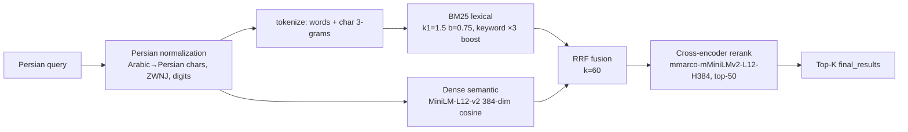
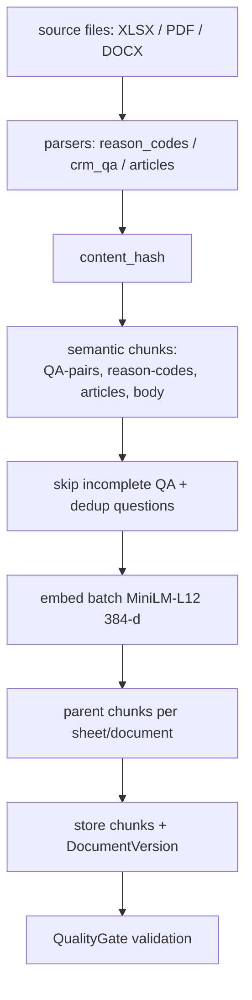

# Work RAG KB

Persian knowledge-base lifecycle, hybrid retrieval, and KB web UI for the Work Credit RAG platform.

> Status: **implemented and operational.** The retrieval pipeline and Web UI run from `kb-manager/` (see [kb-manager/README.md](kb-manager/README.md) for current benchmark numbers and quick start). Current release **v7** (1405-05-31 KB, 34 docs / 2,074 chunks, IVA 15-question doc-level Hit@5 73.3%) — see [kb-manager/README.md](kb-manager/README.md#version-history--differences) for the full version history and per-version differences. The top-level documents ([`KB_ARCHITECTURE.md`](KB_ARCHITECTURE.md), [`retrieval-evaluation-research.md`](retrieval-evaluation-research.md)) hold the architecture plan and IR evaluation theory.

## 1. Summary

The Knowledgebase component owns **source documents, ingestion, indexing, retrieval, reranking, and KB evaluation**. It does **not** own model lifecycle, safety policy, conversation orchestration, or the frontend.

Core capabilities:

- Ingest Persian `XLSX` / `PDF` / `DOCX` into a versioned KB (SQLite at runtime, pgvector for production).
- Semantic chunking tuned to the ICS domain: **QA pairs**, **reason codes**, **articles**, section headings, with parent chunks and QA dedup.
- Embed with `paraphrase-multilingual-MiniLM-L12-v2` (384-dim) and cache to `.npz`.
- **Hybrid retrieval**: BM25 + dense → RRF fusion → cross-encoder rerank (see diagram).
- Web UI (dashboard, documents, chunks, pipeline, search, benchmarks, versions, cleanup, monitoring) on port `8000`.
- Benchmark + evaluation harness (120 frozen queries, verbatim + paraphrase + typo + reworded + conversational + keyword formats).

The full architecture & processing plan (data taxonomy, pgvector schema, preprocessing, chunking, embedding, hybrid retrieval, monitoring, versioning, CI/CD, roadmap) is in [`KB_ARCHITECTURE.md`](KB_ARCHITECTURE.md).

---

## 2. Repository layout

```text
components/knowledgebase/
├── KB_ARCHITECTURE.md            # 2k-line architecture + processing plan
├── retrieval-evaluation-research.md  # IR metrics / frameworks / evaluation
└── kb-manager/                   # the main package
    ├── README.md                 # quick start + current retrieval metrics
    ├── pyproject.toml
    ├── run_server.py / start_server.py
    ├── Dockerfile / docker-compose.yml
    ├── kb_manager/
    │   ├── cli.py                # ingest, status, search, serve, inspect, eval-*
    │   ├── config.py             # env-var config (DB, embedding, chunking, parser)
    │   ├── dense.py / reranker.py
    │   ├── query_reform.py       # HyDE, multi-query, RRF fusion
    │   ├── preprocessor/ chunker/ embedder/ pipeline/
    │   └── web/
    │       ├── app.py            # FastAPI app + index prewarm
    │       └── routes/           # documents, chunks, pipeline, versions,
    │                             #   monitoring, search, benchmarks, cleanup
    ├── tests/                    # 17 tests
    ├── evaluation/               # benchmark, generators, metrics, datasets, famteb
    └── synthetic_generation/     # synthetic Persian QA/conv generation
```

---

## 3. Retrieval architecture

### 3.1 Four-stage hybrid pipeline



### 3.2 Ingestion pipeline



### 3.3 Key parameters

| Stage | Param | Value |
|---|---|---|
| BM25 | k1 / b | 1.5 / 0.75 |
| BM25 | keyword boost | ×3 |
| BM25 | Persian char n-grams | 3 |
| Dense | model / dim | `paraphrase-multilingual-MiniLM-L12-v2` / 384 |
| Dense | batch | 64 |
| RRF | k | 60 |
| Rerank | model | `cross-encoder/mmarco-mMiniLMv2-L12-H384-v1` |
| Rerank | candidate window | top-50 |
| Chunk | strategy / max tokens | semantic / 512 |
| Chunk | parent max / scope | 1536 / sheet |

---

## 4. API endpoints (KB Manager)

### Web UI pages

| Path | Page |
|---|---|
| `/` | Dashboard |
| `/documents` | Documents |
| `/chunks` | Chunks |
| `/pipeline` | Pipeline (run ingestion) |
| `/search` | Search page |
| `/benchmarks` | Benchmarks |
| `/benchmarks/comparison` | Version comparison |
| `/versions` | Versions |
| `/cleanup/qa` | QA cleanup |
| `/monitoring` | Monitoring |

### JSON APIs

| Method | Path | Purpose |
|---|---|---|
| `POST` | `/search/api` | **Hybrid search** — returns step-by-step `SearchSteps` + `final_results` |
| `GET` | `/documents` | List docs (filters + pagination) |
| `GET` | `/documents/{doc_id}` | Doc detail with chunks |
| `POST` | `/documents/upload` | Upload file (creates draft doc) |
| `POST` | `/documents/{doc_id}/delete` | Soft-delete (archive) |
| `GET` | `/chunks` / `/chunks/{chunk_id}` | List / detail chunks |
| `POST` | `/chunks/{id}/verify` / `/edit` | Verify / edit chunk |
| `GET` | `/pipeline` / `POST /pipeline/run` / `GET /pipeline/status/{job_id}` | Pipeline control |
| `GET` | `/versions` / `POST /versions/{doc_id}/rollback/{version_id}` | Version history + rollback |
| `GET` | `/monitoring/staleness`, `/monitoring/metrics` | Staleness + metrics |
| `POST` | `/benchmarks/run`, `GET /benchmarks/status/{job_id}`, `GET /benchmarks/result` | Benchmark runner |
| `GET` | `/benchmarks/comparison/data`, `/benchmarks/snapshots*` | Comparison + snapshots |

### Search response (`/search/api`)

```jsonc
{
  "final_results": [
    {
      "chunk_id": "chunk-123",
      "doc_id": "doc-1",
      "doc_title": "گزارش اعتباری",
      "heading_path": "فصل ۲ / گزارش",
      "content_preview": "… متن کوتاه …",
      "rerank_score": 0.87,          // or hybrid_score
      "hybrid_score": 0.81
    }
  ]
}
```

The orchestrator maps these KB-native field names to its internal `KBRetrievalResult`.

---

## 5. CLI commands

| Command | Purpose |
|---|---|
| `kb-manager ingest [-s DIR] [--full] [-m MODEL] [--parent-scope sheet\|document]` | Ingest (full or incremental) |
| `kb-manager status` | Doc/chunk counts (rich table) |
| `kb-manager search -q "..." -k 5` | Vector search (cosine, `<=>`) |
| `kb-manager serve` | Start uvicorn web server (reload) |
| `kb-manager inspect -f file.xlsx` | Inspect file structure |
| `kb-manager eval-generate [-n N]` | Generate synthetic eval dataset |
| `kb-manager eval-run -i dataset -k N` | Run retrieval evaluation |
| `kb-manager status-chunks` | Chunk statistics (types, tokens, QA completeness) |

---

## 6. Configuration (environment variables)

| Env var | Default | Purpose |
|---|---|---|
| `KB_DB_URL` | `sqlite+aiosqlite:///./data/kb_test.db` | DB URL (SQLite runtime / `postgresql+asyncpg` prod) |
| `KB_DB_HOST/PORT/NAME/USER/PASSWORD` | `localhost/5432/kb_manager/postgres/postgres` | pgvector target |
| `KB_EMBED_MODEL` | `sentence-transformers/paraphrase-multilingual-MiniLM-L12-v2` | embedding model |
| `KB_EMBED_DIM / BATCH` | `384 / 64` | embedding params |
| `KB_CHUNK_STRATEGY / MAX` | `semantic / 512` | chunking |
| `KB_CHUNK_PARENT_MAX / SCOPE` | `1536 / sheet` | parent chunks |
| `KB_SOURCE_DIR` | `./kb-source` | source documents |
| `KB_WEB_HOST / PORT` | `0.0.0.0 / 8000` | web server |
| `KB_LLM_BACKEND` | `mock` | `mock`/`openai`/`ollama`/`vllm` (HyDE/multi-query) |

---

## 7. Database

- **Runtime:** SQLite (`sqlite+aiosqlite`, ~2.7 GB corpus in dev) — used by the web server and tests.
- **Production target:** PostgreSQL + pgvector (`postgresql+asyncpg`), provisioned by `docker-compose.yml` (`scripts/init_db.sql` enables `vector`, `pg_trgm`, `uuid-ossp`).
- ORM models (SQLAlchemy 2.0 async): `Document`, `Chunk` (self-FK `parent_id`, `embedding_model`, `quality_score`, `is_verified`), `DocumentVersion`, `IngestionJob`, `RetrievalLog`.

```bash
cd kb-manager
docker compose up -d   # pgvector on :5432 + kb-manager on :8000
```

---

## 8. Tests

| File | Covers |
|---|---|
| `test_chunker.py` | semantic chunking, incomplete-QA skip, parent scope, QA Persian field formatting, FixedChunker |
| `test_parsers.py` | XLSX (reason_codes, crm_qa), DOCX, parser registry |
| `test_preprocessor.py` | Persian normalization, HTML/URL/whitespace, pipeline quality |
| `test_pipeline.py` | orchestrator scan (full vs incremental) |
| `test_embedder.py` | dims, query embed, content-hash cache |
| `test_evaluation.py` | Ranx vs pure-Python fallback, Ragas availability |
| `test_cli.py` | version, inspect |

```bash
cd kb-manager
pytest tests/ -v
```

---

## 9. Run

```bash
cd components/knowledgebase/kb-manager
pip install -e ".[dev]"
python run_server.py          # port 8000 (prewarms BM25 + dense + reranker, ~30-60s)
python -m kb_manager.cli ingest --full   # (once) build the KB from kb-source
# or: docker build -t work-rag-kb . && docker run -p 8000:8000 work-rag-kb
```

---

## 10. Persian resources

[`kb-manager/PERSIAN_RESOURCES.md`](kb-manager/PERSIAN_RESOURCES.md) catalogs Persian NLP options: FaMTEB benchmark suite, embedding models (current MiniLM + candidates like BGE-M3, ParsBERT, FaBERT), cross-encoders, libraries (Hazm, Parsivar, Persian-tools), ZWNJ handling, and evaluation metrics.

---

## 11. Planning & progress checklist

### Done (MVP)

- [x] Persian normalization + extraction (XLSX / PDF / DOCX)
- [x] Semantic chunking (QA pairs, reason codes, articles) + parent chunks
- [x] Skip incomplete QA + dedup by normalized question
- [x] Dense embedder (MiniLM-L12v2, 384-d) with content-hash cache
- [x] BM25 (char 3-grams, keyword boost) + RRF(k=60) + cross-encoder rerank
- [x] `/search/api` normalized response + Web UI (port 8000)
- [x] Pipeline orchestration (full rebuild vs incremental) + versioning + rollback
- [x] Benchmark harness (v5: 120 frozen queries, Hit@5 84.2%, MRR 0.751)
- [x] Dockerfile + docker-compose (SQLite runtime / pgvector target)
- [x] Test suite (17 tests) passing

### Next / open

- [ ] pgvector production migration + indexes (`vector`, `pg_trgm`)
- [ ] Wire HyDE / multi-query reformulation end-to-end (default off)
- [ ] Contextual retrieval live toggle wiring
- [ ] Re-generate synthetic eval dataset with current KB (regen script)
- [ ] Staleness → auto-reingest cron/pipeline integration
- [ ] CI/CD for KB evaluation runs on every ingest
  - [ ] Persist benchmark comparison plots as immutable snapshots

---

## License

See parent repository `LICENSE` and the submodule's own obligations (`kb-manager` is private — ICS Credit Scoring).