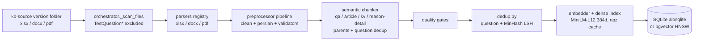
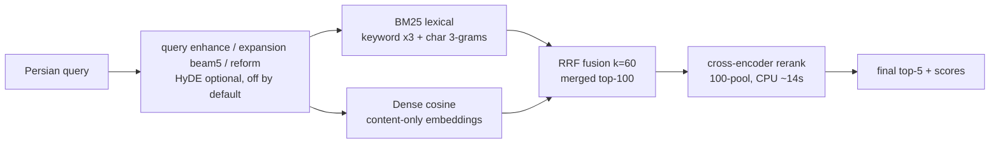
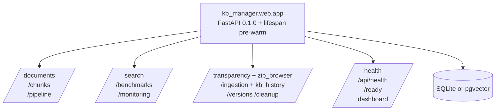

# KB Manager — Persian RAG Knowledge Base

> **ICS Credit Scoring Knowledge Base** — ingest, chunk, version, and serve a Persian-language corpus (credit reports, cheque scoring, CRM Q&A) for RAG agents, with hybrid retrieval (BM25 + dense + RRF + cross-encoder rerank), stage-level benchmarks, and a FastAPI operations UI.

- **Current KB:** `v11_1405-06-23` — 35 docs / 2,227 chunks, Hit@5 **0.8585**, MRR 0.8271
- **Stack:** FastAPI · SQLAlchemy (async) · SQLite / pgvector · sentence-transformers · cross-encoder rerankers · hazm/shekar (Persian) · Click + Rich CLI
- **Validated:** `compileall` clean · `pytest` **116 passed**, 3 skipped, 1 pre-existing env-dependent failure (2026-09-29)

## Contents

- [Features](#features)
- [Architecture](#architecture)
- [Project structure](#project-structure)
- [Tech stack](#tech-stack)
- [Getting started](#getting-started)
- [Configuration](#configuration)
- [API & UI](#api--ui)
- [Version history](#version-history)
- [Architecture evolution](#architecture-evolution)
- [Benchmarks & metrics](#benchmarks--metrics)
- [Latency](#latency)
- [LLM-as-judge feedback & root causes](#llm-as-judge-feedback--root-causes)
- [Evaluation reports](#evaluation-reports)
- [Development](#development)

## Features

- **Multi-format ingest** — `.xlsx` (openpyxl/calamine), `.docx`, `.pdf` (PyMuPDF) via a parser registry (`kb_manager/parsers/`), orchestrated full/incremental rebuilds (`kb_manager/pipeline/orchestrator.py`) with quality gates (`pipeline/quality.py`) and versioning (`pipeline/versioning.py`).
- **Semantic chunking** — `semantic` / `fixed` strategies (`kb_manager/chunker/`); QA-pair, article, kv-pair, reason-detail, single-col-list and staff-profile schemas with parent chunks, question dedup, and overlap control.
- **Hybrid retrieval** — lexical BM25 + dense MiniLM-L12 cosine index (numpy `.npz` cache with content fingerprint) → RRF fusion → cross-encoder rerank (`kb_manager/dense.py`, `kb_manager/reranker.py`, `kb_manager/web/routes/search.py`).
- **Persian query path** — normalization (`preprocessor/persian.py`, `regex_persian.py`), synonym/beam expansion (`query_expansion.py`, 74-entry colloquial→formal map), reform/enhance stages, optional HyDE (`hyde.py`, off by default).
- **Operations UI** — dashboard, transparency views (RTL Persian), 5-step ingestion wizard, benchmarks, chunk/document browsers, zip browser, monitoring (`kb_manager/web/routes/`, 12 routers).
- **Stage-level evaluation** — every gold row classified A / A′ / B / D with per-stage top-k lists dumped to JSONL, plus a live TUI dashboard and LLM-judge corpus tooling (`artifacts/retrieval_training/`).

## Architecture

### Ingest pipeline



### Retrieval pipeline (per query)



### Web service



Lifespan pre-warm loads the BM25 index + MiniLM embeddings + cross-encoder (~30 s first boot) so the first query is fast (`kb_manager/web/app.py:14-57`).

## Project structure

```
kb-manager/
├── kb_manager/
│   ├── cli.py                 # CLI: ingest / status / search / serve / inspect / eval-* / dedup
│   ├── config.py              # dataclass config, KB_* env resolution (0.0.0.0:8000, sqlite default)
│   ├── dense.py               # numpy cosine index, npz cache + fingerprint, use_context=False
│   ├── reranker.py            # cross-encoder registry (BGE default, MiniLM fallback), pool override
│   ├── chunker/               # base / fixed / semantic / registry (strategies: semantic, fixed)
│   ├── parsers/               # base / xlsx / docx / pdf / registry
│   ├── preprocessor/          # clean / persian / regex_persian / validators / pipeline
│   ├── embedder/              # base / sentence_transformer / registry
│   ├── pipeline/              # orchestrator / quality / versioning
│   ├── models/                # database / schemas / queries
│   ├── web/                   # app.py + routes/ (12 routers) + templates/ + static/
│   │   └── routes/            # benchmarks, chunks, cleanup, documents, ingestion_suite,
│   │                          # kb_history, monitoring, pipeline, search, transparency,
│   │                          # versions, zip_browser
│   ├── evaluation/            # synthetic generator + retrieval metrics
│   ├── retrieval_training/    # mining / stage analysis packages
│   ├── versioning/            # KB snapshot/version helpers
│   ├── dedup.py               # question + MinHash LSH dedup pipeline
│   ├── query_expansion.py     # synonym beam5 + colloquial→formal map
│   ├── query_reform.py query_enhance.py hyde.py llm.py famteb.py
│   └── synonym_*.py cleanup/
├── tests/                     # 15 test modules (chunker, parsers, pipeline, embedder,
│                              # evaluation, ingestion_suite, kb_history, qa_massive, …)
├── configs/                   # default.yaml + chunking/
├── versions/                  # v1, v2, v4_retrieval, v6, v7_iva_1405-05-31,
│                              # v10_1405-06-23, v11_1405-06-23 (manifest + export + report)
├── artifacts/retrieval_training/  # agent2 benchmark, JSONL rows, live_dashboard.py,
│                              # rca/ + rca_judge/ corpora, report_plots/, HTML+PDF reports
├── data/                      # kb_*.db, dense_embeddings.npz, v10_source/, plots/
└── pyproject.toml             # deps, kb-manager entry point, pytest/ruff/mypy config
```

Corpus sources live in the **`kb-source` submodule** (`Work_RAG-KB-SourceFiles`): version folders `1405-05-31`, `1405-06-23` (current ingestion), `1405-06-28` (source added, pending ingest).

## Tech stack

| Layer | Libraries / models (pinned in `pyproject.toml`) |
|-------|-----------------------------------------------|
| API / server | `fastapi>=0.115`, `uvicorn[standard]>=0.30`, `jinja2`, `python-multipart`, `pyyaml` |
| Data | `sqlalchemy[asyncio]>=2.0` (`aiosqlite` / `asyncpg`), `pgvector>=0.3`, `psycopg2-binary` |
| Retrieval | `sentence-transformers>=3.0` (MiniLM-L12 384d), `torch>=2.0`, cross-encoders: default `BAAI/bge-reranker-v2-m3`, benchmark runs `cross-encoder/mmarco-mMiniLMv2-L12-H384-v1`, `numpy>=1.24` |
| Persian NLP | `hazm>=0.10`, `shekar>=0.5` + local `regex_persian.py` maps |
| Parsing | `openpyxl` (+calamine engine option), `python-docx`, `PyMuPDF`, `pandas>=2.0` |
| CLI | `click>=8.1`, `rich>=13` (`kb-manager = kb_manager.cli:main`) |
| Dev / QA | `pytest` + `pytest-asyncio` + `pytest-cov`, `httpx`, `ruff`, `mypy --strict` |
| Reporting | `matplotlib` (plots), `fpdf2` (PDF export) |

## Getting started

```bash
pip install -e ".[dev]"        # or: pip install -e .
export KB_DB_MODE=sqlite       # sqlite (default) | pgvector
export KB_SQLITE_PATH=./data/kb_test.db
export KB_SOURCE_DIR=/path/to/kb-source/1405-06-23

python -m kb_manager.cli ingest --full -s "$KB_SOURCE_DIR"   # full rebuild
python -m kb_manager.cli status                              # doc/chunk counts
python -m kb_manager.cli search -q "…" -k 5                  # CLI search
python -m kb_manager.cli serve                               # web on 0.0.0.0:8000
```

Useful extras: `inspect <file>` (parser dump), `status-chunks`, `dedup --dry-run`, `eval-generate` / `eval-run`.

## Configuration

Defaults from `kb_manager/config.py` (all overridable via `KB_*` env):

| Key | Default | Notes |
|-----|---------|-------|
| `KB_DB_MODE` | `sqlite` | `sqlite` (aiosqlite) or `pgvector` (asyncpg); `KB_DB_URL` overrides |
| `KB_SQLITE_PATH` | `./data/kb_test.db` | production runs point at `data/kb_1405_06_23.db` |
| `KB_SOURCE_DIR` | `<root>/kb-source` | pass `-s` to ingest for an explicit version folder |
| `KB_WEB_HOST` / `KB_WEB_PORT` | `0.0.0.0` / `8000` | |
| Chunking | `semantic`, max 512 / min 100 / overlap 50, parent 1536, scope `sheet`, `dedup_questions=True` | v11: overlap skipped for row-wise atomic chunks |
| Dense | MiniLM-L12, 384d, batch 64, L2-normalised, `use_context=False` | npz fingerprint includes the flag → auto-rebuild |
| Reranker | `BAAI/bge-reranker-v2-m3` (config default) | v10/v11 benchmark runs used the MiniLM cross-encoder |
| Fusion | RRF k=60, rerank pool 100 | reranker adds ≈ +0.27 Hit@5 over RRF (v11) |

## API & UI

Routers mounted in `kb_manager/web/app.py:90-101` — `/documents`, `/chunks`, `/pipeline`, `/versions`, `/monitoring`, `/search`, `/benchmarks`, `/cleanup`, `/transparency` (+ zip browser), `/ingestion` (+ KB history) — plus `/health`, `/api/health`, `/ready` and `/` dashboard. The UI ships Persian RTL views (`Vazirmatn`) and a live massive-benchmark page.

## Version history

| Ver | Corpus | Pipeline / retrieval | Benchmark (measured) |
|-----|--------|---------------------|----------------------|
| v1 | ~160 files (31Tir1405) | baseline ingest + BM25 | — |
| v2 | 355 docs / 6,208 chunks | BM25 + TF-IDF (RRF k=60) | Hit@5 90%, MRR 0.736, 2.8 s |
| v3 | 355 docs / 6,208 chunks | + dense MiniLM-L12 + RRF | Hit@5 89.2%, MRR 0.787, 1.9 s |
| v4 | 355 docs / 6,208 chunks | + char 3-grams + cross-encoder reranker | Hit@5 90%, MRR 0.775, 15.8 s (rerank cost) |
| v5 | 355 docs / 6,208 chunks | frozen dataset + BM25×3 | Hit@5 84.2%, MRR 0.751, 4.2 s |
| v6 | 69 docs / 3,626 chunks | P0–P8 remediation, Persian central, synonym beam5, MinHash dedup | 10-q smoke 100% Hit@5 |
| v7 | 34 docs / 2,074 chunks | fresh 1405-05-31 KB, TestQuestion* excluded, colloquial expansion, IVA-15 | doc-Hit@5 73.3% (11/15), MRR 0.466 |
| v8 | 103 docs / 6,593 chunks | pgvector HNSW-384 + tunable keyword×3.0 | HNSW 23.1 s → GPU 18.4 s |
| v9 | 21+32 docs / ~1,084 chunks | KB_9.7.2026 type-aware, transparency/zip, massive-live | IVA 11/15 (73.3%), MRR 0.474 |
| v10 | **35 docs / 2,282 chunks** | 1405-06-23, kv/single-col schemas, stage-level bench (old A/B/C/D taxonomy) | **Hit@5 0.9244**, Hit@1 0.7703, MRR 0.8369 — A=46 B=6 C=2 D=660, 0 errors |
| v11 ⭐ | **35 docs / 2,227 chunks** | chunkfix rebuild + A/A′ diagnostics + dense `use_context=False` | **Hit@5 0.8585**, MRR 0.8271 — A=25 A′=8 B=13 D=613, err=55 (all Cheque OOM) |

v11 manifest: `versions/v11_1405-06-23/manifest.json`. v10 export: `versions/v10_1405-06-23/`.

## Architecture evolution

- **v1→v4 — hybrid core.** Baseline BM25 ingest grew a dense MiniLM leg with RRF-k60 fusion, char 3-grams for Persian typos, and a cross-encoder rerank stage. Latency moved 2–4 s → ~16 s on CPU: the reranker pool is the cost center (still true in v11).
- **v5→v6 — quality remediation.** Frozen checksummed datasets, BM25 keyword weighting, Persian regex central, question + MinHash-LSH dedup, fingerprint/invalidation, async fixes.
- **v7→v9 — fresh corpora + scale-out.** Isolated 1405-05-31 rebuild with test-dir exclusion and colloquial expansion; pgvector HNSW-384 backend; KB_9.7.2026 type-aware chunking with transparency/zip tooling.
- **v10 — measurement.** New `kv_pair` / `single_col_list` schemas, ingest-time variable fan-out, 5-step ingestion wizard, and the first full-corpus stage-level benchmark (714 gold rows, per-stage top-k JSONL).
- **v11 — chunkfix (current).** Three pollution fixes, all verified at `0` residual in the live DB across all QA files:
  1. overlap prefix removed from row-wise atomic chunks (`chunker/semantic.py:426`);
  2. `کلیدواژه‌ها:` label stripped from QA content, keywords kept only in the JSON column (`chunker/semantic.py:485-486,494`);
  3. dense `use_context` default `True→False` with fingerprint-gated auto-rebuild (`dense.py:124,257`) — ablation: recall@100 0.822→0.962.
  
  Plus A vs A′ fusion-loss diagnostics (`agent2_v10_1405_06_23.py`) and the live funnel TUI (`live_dashboard.py`).

## Benchmarks & metrics

v11 post-fix run (714 gold rows, 659 executed; reranker `cross-encoder/mmarco-mMiniLMv2-L12-H384-v1`):

| Label | Count | Meaning |
|-------|-------|---------|
| D success | 613 | gold in final top-5 |
| A retriever miss | 25 | gold in neither BM25 nor dense top-100 (Company 14, Individual 7, Public 4, **Cheque 0**) |
| A′ fusion loss | 8 | one leg found gold, RRF dropped it |
| B reranker loss | 13 | merged top-100 → dropped from top-5 |
| error (infra) | 55 | OOM/paging, **all in ChequeQuestions** |


### Stage funnel (659 executed rows)

| Stage | Hit@5 | Recall@100 |
|-------|-------|------------|
| BM25 | 380 (0.577) | 572 (0.868) |
| Dense | 399 (0.606) | 552 (0.838) |
| Merged RRF | 435 (0.660) | 626 (0.950) |
| Final rerank | **613 (0.930)** | — |


### Per-file Hit@5 (denominator = all gold rows incl. errors)

| File | n | Hit@5 | Funnel |
|------|---|-------|--------|
| Company_CRM_Questions | 332 | 0.9157 | D=304 A=14 A′=6 B=8 |
| IndividualCRMQuestions | 179 | 0.9330 | D=167 A=7 A′=1 B=4 |
| PublicQuestions.xlsx | 55 | 0.9273 | D=51 A=4 |
| Individual_CRM_Questions_categorized | 10 | 0.9000 | D=9 A′=1 |
| DisputeQuestions / EtebaritoProblems | 19 | 1.0000 | D=19 |
| **ChequeQuestions** | 117 | **0.5214** | D=61 B=1 err=55 → **61/62 = 0.9839 on executed rows** |


### v10 vs v11

| Metric | v10 pre-fix | v11 post-fix |
|--------|-------------|--------------|
| Hit@5 | 0.9244 | 0.8585 (0.9302 on executed rows) |
| MRR | 0.8369 | 0.8271 |
| Funnel | A=46 (lumped) B=6 C=2 D=660, err=0 | A=25 A′=8 B=13 D=613, err=55 |
| Chunk pollution | overlap + keyword label + dense prefix present | 0 label leaks / 0 overlap prefixes (verified) |

The Hit@5 gap is confounded by the KB rebuild (rotated chunk IDs, re-chunked content) and the 55 Cheque OOMs counted as misses — not by the three fixed pollutions. Title-removal ablation (measured, `title_removal_experiment.json`):


Dense recall@100 **0.822 → 0.962**, recall@5 0.413 → 0.793 with content-only embeddings.

## Latency

Measured per-query `elapsed_ms` from the v11 benchmark JSONL (659 executed rows; CPU cross-encoder, 100-pool):

| Slice | n | mean | p50 | p95 | max |
|-------|---|------|-----|-----|-----|
| overall | 659 | 15.0 s | 13.7 s | 22.3 s | 282.1 s |
| ChequeQuestions | 62 | 13.8 s | 13.6 s | 17.7 s | 31.2 s |
| Company_CRM_Questions | 332 | 15.7 s | 13.9 s | 22.5 s | 282.1 s |
| IndividualCRMQuestions | 179 | 14.6 s | 13.2 s | 24.9 s | 41.2 s |
| PublicQuestions.xlsx | 55 | 14.0 s | 13.7 s | 17.6 s | 20.1 s |

The rerank stage dominates (BM25/dense/RRF are ms-scale). GPU-backed runs in earlier versions measured ~4 s (v5) and 18.4 s HNSW-vs-23.1 s CPU (v8).

## LLM-as-judge feedback & root causes

Judge corpus: `artifacts/retrieval_training/rca_judge/judge_*.md` (gold full text vs retrieved-winner full text + token-Jaccard) with group RCAs in `rca/`. Note the judge files were built pre-fix, so their gold excerpts still show the old `...` prefix and `کلیدواژه‌ها:` label — itself evidence of the pollution v11 removed.

- **Company#141 (B)** — q↔gold Jaccard 0.292 (7 shared: اعضای، گذارد…) vs q↔winner 0.083. *Fusion casualty:* dense had gold at 15, RRF pushed it to merged-62, reranker never recovered (final 11). → weighted fusion / merged-top pinning.
- **Company#151 (C)** — q↔gold 0.084 vs q↔winner 0.075. *Lexical trap:* 9 near-identical Cheque_ReasonCode keyword-stuffed rows (≈249.17 BM25) buried gold at BM25-28. → reason-code sheet quarantine / keyword de-boost.
- **Company#202 (B)** — dense 80 → merged 94 → final 43. *Dense-invisible phrasing* («چه زمانی… اقدام کنم»). → query-rewrite / paraphrase augmentation.
- **Cheque#26 (B)** — BM25=7, merged=12, final=6. *Twin crowding, correct-but-second:* two distractors carry the identical short answer as the gold's family (scores 1.0/0.9999); 16 of 92 Cheque short answers are duplicated. → answer-level dedup before scoring.
- **Cheque#64–66 (errors)** — empty rank lists, `MemoryError` / paging-1455. *Not a retrieval judgment.* → infra (rerank batch/RAM/pagefile), re-run with `--resume`.


Ranked root causes: (1) infra OOM on the Cheque slice — 55/117 rows, sole cause of the 0.521 headline; (2) twin crowding — real but small (1 B row, −1 slot); (3) keyword-stuffed reason-code sheets — pre-fix BM25 flooding, fixed in v11; (4) true retriever misses A=25 in Company/Individual/Public; (5) reranker near-misses B=13, the largest rescue opportunity after the infra fix.

## Evaluation reports

- `artifacts/retrieval_training/cheque_eval_report.html` — full breakdown with Persian samples + plots (242 KB)
- `artifacts/retrieval_training/cheque_eval_report.pdf` — plots + tables, ASCII-safe (186 KB)
- `artifacts/retrieval_training/report_metrics.json` — machine-readable funnel/stage/latency summary
- `artifacts/retrieval_training/retrieval_failures_v10_1405-06-23.jsonl` — 714 rows with per-stage top-k
- `artifacts/retrieval_training/live_dashboard.py` — live funnel TUI
- `docs/retrieval_training/RCA_v10_README.md` — consolidated RCA

## Development

```bash
python -m pytest tests/ -q        # suite (116 passed / 3 skipped; 1 pre-existing
                                  # env-dependent failure: test_qa_massive_count finds
                                  # 0 QA files under the default source resolution)
python -m compileall -q kb_manager
ruff check kb_manager tests
mypy kb_manager                   # strict
```

Docs live under `docs/` (retrieval training, architecture notes, Persian resources). KB snapshots under `versions/` with manifest + export + report per version.
