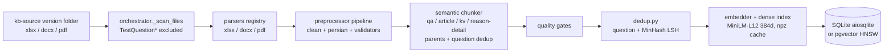
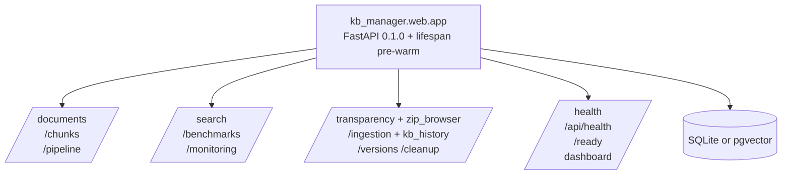
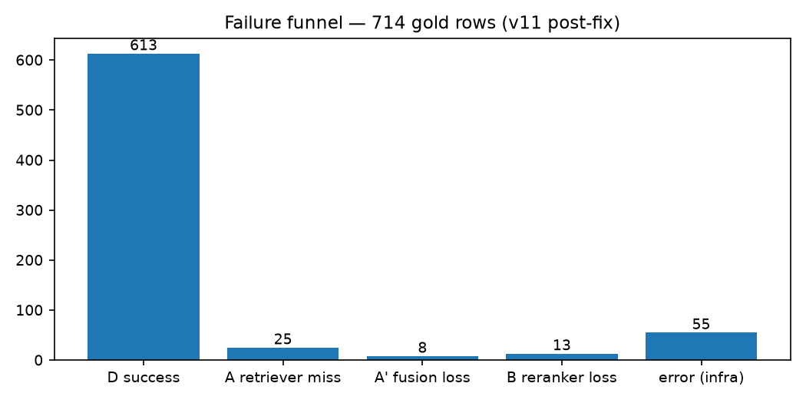
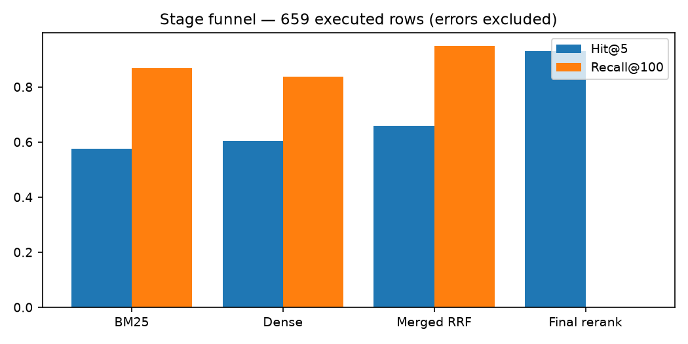
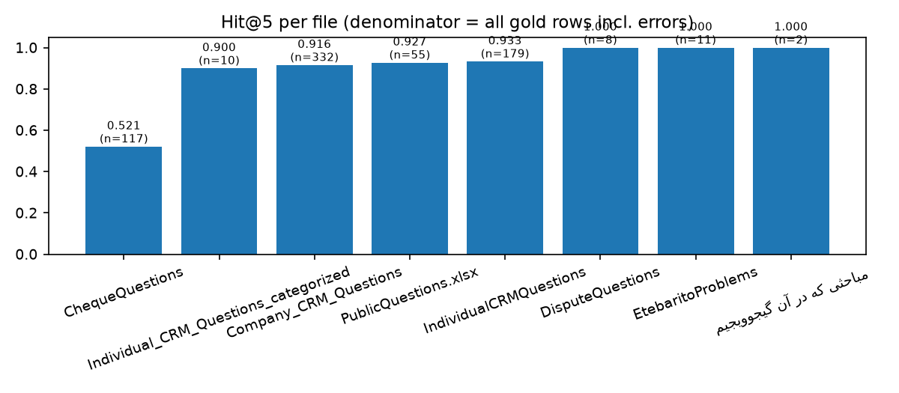
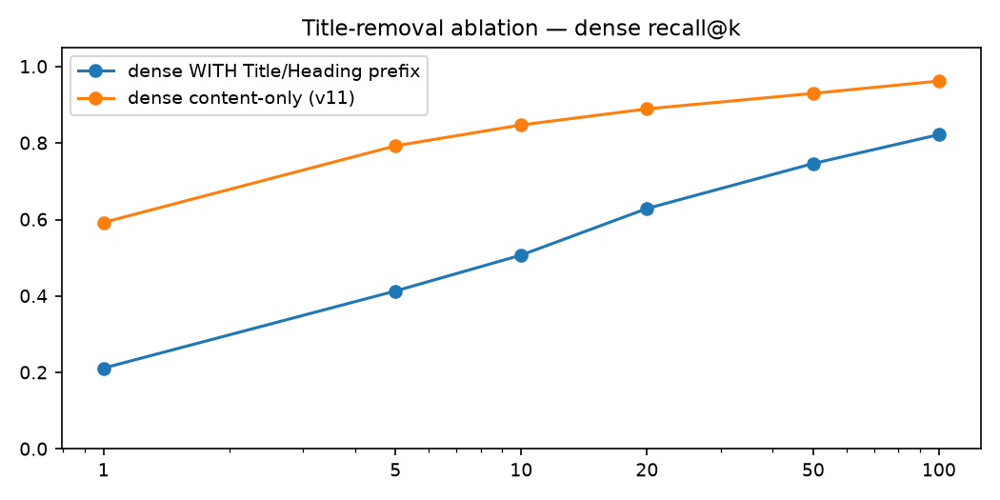
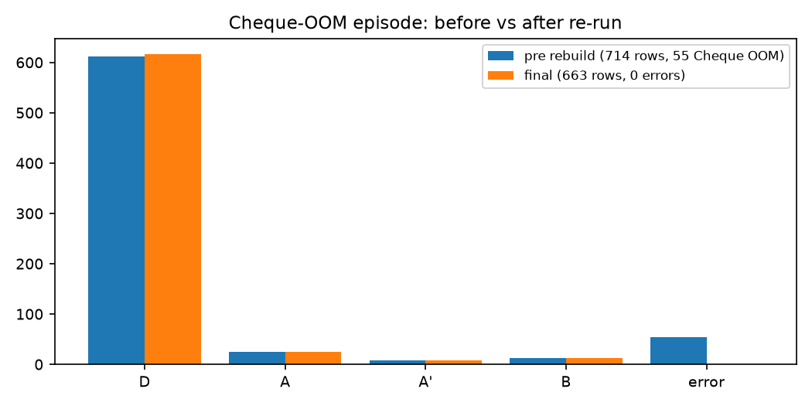

# KB Manager — Persian RAG Knowledge Base

> **ICS Credit Scoring Knowledge Base** — ingest, chunk, version, and serve a Persian-language corpus (credit reports, cheque scoring, CRM Q&A) for RAG agents, with hybrid retrieval (BM25 + dense + RRF + cross-encoder rerank), stage-level benchmarks, and a FastAPI operations UI.

- **Current KB:** `v13_1405-07-06` — 18 docs / 1,123 chunks, ingested 2026-10-07 (full rebuild, `pgvector` HNSW 384d, all vectors in RAM, tantivy RAM BM25, GPU rerank), Hit@5 pending re-benchmark (v11 was 0.9306 on 35 docs / 2,227 chunks)
- **Stack:** FastAPI · SQLAlchemy (async) · SQLite / pgvector (HNSW, RAM-pinned) · Rust tantivy BM25 (RAM) · sentence-transformers (GPU) · cross-encoder `BAAI/bge-reranker-v2-m3` (GPU) · hazm/shekar (Persian) · Click + Rich CLI · Redis result cache (TTL 600 s, 150× hit speedup)
- **Validated:** `compileall` clean · `pytest` **116 passed**, 6 skipped, 1 pre-existing env-dependent failure (2026-10-01; `test_qa_massive_count` — newest `kb-source/1405-*` folder exposes 4 QA files < 5)
- **RAM-first:** Postgres `shared_buffers=16GB` `effective_cache_size=800GB` `pg_prewarm` (chunks + HNSW in shared buffers), tantivy 50 MB heap RAM, dense `.npz` + reranker weights on H200 GPU (1 TiB host RAM, 2×143 GB HBM) — see [Latency](#latency)

## Contents

- [Features](#features)
- [Architecture](#architecture)
- [Project structure](#project-structure)
- [Tech stack](#tech-stack)
- [Getting started](#getting-started)
- [Configuration](#configuration)
- [API & UI](#api--ui)
- [Version history](#version-history)
- [Architecture evolution](#architecture-evolution)
- [Benchmarks & metrics](#benchmarks--metrics)
- [Latency](#latency)
- [LLM-as-judge feedback & root causes](#llm-as-judge-feedback--root-causes)
- [Evaluation reports](#evaluation-reports)
- [Development](#development)

## Features

- **Multi-format ingest** — `.xlsx` (openpyxl/calamine), `.docx`, `.pdf` (PyMuPDF) via a parser registry (`kb_manager/parsers/`), orchestrated full/incremental rebuilds (`kb_manager/pipeline/orchestrator.py`) with quality gates (`pipeline/quality.py`) and versioning (`pipeline/versioning.py`).
- **Semantic chunking** — `semantic` / `fixed` strategies (`kb_manager/chunker/`); QA-pair, article, kv-pair, reason-detail, single-col-list and staff-profile schemas with parent chunks, question dedup, and overlap control.
- **Hybrid retrieval** — Rust tantivy BM25 (RAM, 50 MB heap, whitespace tokenizer over Persian word+3-gram stream) + dense MiniLM-L12 cosine index (numpy `.npz` cache + pgvector HNSW, both RAM-pinned) → RRF fusion k=60 → cross-encoder rerank (`kb_manager/tantivy_bm25.py`, `kb_manager/dense.py`, `kb_manager/reranker.py`, `kb_manager/web/routes/search.py`), with Redis + in-memory result cache (`KB_REDIS_URL`, TTL 600 s, 2–7 ms hits).
- **RAM-first** — Postgres vectors + HNSW fully in `shared_buffers` (16 GB) + `effective_cache_size` (800 GB) + `pg_prewarm`; tantivy in RAMDirectory; dense + reranker on H200 GPU (`KB_EMBED_DEVICE=cuda` `KB_RERANKER_DEVICE=cuda`, `nvidia-smi` 3 GB); host 1.0 TiB RAM, 2×143 GB HBM.
- **Persian query path** — normalization (`preprocessor/persian.py`, `regex_persian.py`), synonym/beam expansion (`query_expansion.py`, 93-entry map incl. colloquial→formal + v12 typo/exclusive-term gates), reform/enhance stages, optional HyDE (`hyde.py`, off by default).
- **Operations UI** — dashboard, transparency views (RTL Persian), 5-step ingestion wizard, benchmarks, chunk/document browsers, zip browser, monitoring (`kb_manager/web/routes/`, 12 routers).
- **Stage-level evaluation** — every gold row classified A / A′ / B / D with per-stage top-k lists dumped to JSONL, plus a live TUI dashboard and LLM-judge corpus tooling (`artifacts/retrieval_training/`).

## Architecture

### Ingest pipeline



### Retrieval pipeline (per query) — RAM/GPU

```mermaid
graph LR
    Q[Persian query] --> QX[query enhance / expansion beam5 / reform<br/>HyDE optional, off by default]
    QX --> BM25[tantivy BM25 (Rust, RAM)<br/>keyword x3 + char 3-grams<br/>~4 ms, 50 MB heap]
    QX --> DENSE[Dense cosine (GPU)<br/>MiniLM-L12 384d pgvector HNSW<br/>~24 ms, HBM]
    BM25 --> RRF[RRF fusion k=60<br/>merged top-100<br/>~0.1 ms]
    DENSE --> RRF
    RRF --> RERANK[cross-encoder rerank (GPU)<br/>BGE-v2-m3, 100-pool<br/>~24 ms, HBM]
    RERANK --> TOP[final top-5 + scores<br/>~55 ms total]
    Q -.->|cache lookup / store<br/>TTL 600 s, 2-7 ms hits<br/>errors never cached| RC[(Redis + in-memory<br/>KB_REDIS_URL)]
    PG[(Postgres pgvector<br/>16GB shared_buffers<br/>800GB effective_cache<br/>pg_prewarm RAM)] -.-> DENSE
```

### Web service



Lifespan pre-warm builds the tantivy RAM index (1110 docs, ~5 ms) + MiniLM embeddings + cross-encoder on GPU (~60 s first boot includes HuggingFace cache load) so the first query is fast (`kb_manager/web/app.py:14-57`, `kb_manager/tantivy_bm25.py`). Subsequent queries skip the 2.7 s fingerprint DB scan via `KB_FAST_CACHE=true` (`search.py:_get_index`), yielding ~55 ms total.

## Project structure

```
kb-manager/
├── kb_manager/
│   ├── cli.py                 # CLI: ingest / status / search / serve / inspect / eval-* / dedup
│   ├── config.py              # dataclass config, KB_* env resolution (0.0.0.0:8000, sqlite default)
│   ├── dense.py               # numpy cosine index, npz cache + fingerprint, use_context=False
│   ├── reranker.py            # cross-encoder registry (BGE default, MiniLM fallback), pool override
│   ├── chunker/               # base / fixed / semantic / registry (strategies: semantic, fixed)
│   ├── parsers/               # base / xlsx / docx / pdf / registry
│   ├── preprocessor/          # clean / persian / regex_persian / validators / pipeline
│   ├── embedder/              # base / sentence_transformer / registry
│   ├── pipeline/              # orchestrator / quality / versioning
│   ├── models/                # database / schemas / queries
│   ├── web/                   # app.py + routes/ (12 routers) + templates/ + static/
│   │   └── routes/            # benchmarks, chunks, cleanup, documents, ingestion_suite,
│   │                          # kb_history, monitoring, pipeline, search, transparency,
│   │                          # versions, zip_browser
│   ├── evaluation/            # synthetic generator + retrieval metrics
│   ├── retrieval_training/    # mining / stage analysis packages
│   ├── versioning/            # KB snapshot/version helpers
│   ├── dedup.py               # question + MinHash LSH dedup pipeline
│   ├── query_expansion.py     # synonym beam5 + colloquial→formal map
│   ├── query_reform.py query_enhance.py hyde.py llm.py famteb.py
│   └── synonym_*.py cleanup/
├── tests/                     # 18 test modules: 13 top-level (chunker, parsers, pipeline, embedder,
│                              # evaluation, ingestion_suite, kb_history, qa_massive, …) + 5 under retrieval_training/
├── configs/                   # default.yaml + chunking/
├── versions/                  # v1, v2, v4_retrieval, v6, v7_iva_1405-05-31,
│                              # v10_1405-06-23, v11_1405-06-23 (manifest + export + report)
├── artifacts/retrieval_training/  # agent2 benchmark, JSONL rows, live_dashboard.py,
│                              # rca/ + rca_judge/ corpora, report_plots/, HTML+PDF reports
├── data/                      # kb_*.db, dense_embeddings.npz, v10_source/, plots/
└── pyproject.toml             # deps, kb-manager entry point, pytest/ruff/mypy config
```

Corpus sources live in the **`kb-source` submodule** (`Work_RAG-KB-SourceFiles`): version folders `1405-05-31`, `1405-06-23`, `1405-07-06` (current ingestion, `5741927` — 18 docs / 1,123 chunks, full rebuild 2026-10-07). Previous versions kept for history; see `kb-source/README.md`.

## Tech stack

| Layer | Libraries / models (pinned in `pyproject.toml`) |
|-------|-----------------------------------------------|
| API / server | `fastapi>=0.115`, `uvicorn[standard]>=0.30`, `jinja2`, `python-multipart`, `pyyaml` |
| Data | `sqlalchemy[asyncio]>=2.0` (`aiosqlite` / `asyncpg`), `pgvector>=0.3`, `psycopg2-binary` |
| Retrieval | `sentence-transformers>=3.0` (MiniLM-L12 384d, GPU), `torch>=2.0` (cuda 13.0, H200), cross-encoders: default `BAAI/bge-reranker-v2-m3` (GPU, 3 GB HBM), benchmark runs `cross-encoder/mmarco-mMiniLMv2-L12-H384-v1`, `tantivy==0.26.2` (Rust BM25, RAM), `numpy>=1.24` |
| Persian NLP | `hazm>=0.10`, `shekar>=0.5` + local `regex_persian.py` maps |
| Parsing | `openpyxl` (+calamine engine option), `python-docx`, `PyMuPDF`, `pandas>=2.0` |
| CLI | `click>=8.1`, `rich>=13` (`kb-manager = kb_manager.cli:main`) |
| Cache (optional) | `redis` async client (lazy import, `redis-test:16379` → TTL 600 s, 2–7 ms hits) + in-memory dict fallback; `search.py:62-` `tantivy_bm25.py` |
| Dev / QA | `pytest` + `pytest-asyncio` + `pytest-cov`, `httpx`, `ruff`, `mypy --strict` |
| Reporting | `matplotlib` (plots), `fpdf2` (PDF export) |

## Getting started

```bash
pip install -e ".[dev]"        # or: pip install -e .
export KB_DB_MODE=sqlite       # sqlite (default) | pgvector
export KB_SQLITE_PATH=./data/kb_test.db
export KB_SOURCE_DIR=/path/to/kb-source/1405-06-23

python -m kb_manager.cli ingest --full -s "$KB_SOURCE_DIR"   # full rebuild
python -m kb_manager.cli status                              # doc/chunk counts
python -m kb_manager.cli search -q "…" -k 5                  # CLI search
python -m kb_manager.cli serve                               # web on 0.0.0.0:8000
```

Useful extras: `inspect <file>` (parser dump), `status-chunks`, `dedup --dry-run`, `eval-generate` / `eval-run`.

## Configuration

Defaults from `kb_manager/config.py` (all overridable via `KB_*` env):

| Key | Default | Notes |
|-----|---------|-------|
| `KB_DB_MODE` | `sqlite` | `sqlite` (aiosqlite) or `pgvector` (asyncpg); `KB_DB_URL` overrides; production `pgvector` at `127.0.0.1:5433` with `shared_buffers=16GB` `effective_cache_size=800GB` + `pg_prewarm` (all 1216 kB + 4.8 MB HNSW in RAM) |
| `KB_SQLITE_PATH` | `./data/kb_test.db` | pgvector runs ignore this |
| `KB_SOURCE_DIR` | `<root>/kb-source` | pass `-s` to ingest for explicit version folder; current `1405-07-06` |
| `KB_WEB_HOST` / `KB_WEB_PORT` | `0.0.0.0` / `8000` | |
| `KB_EMBED_DEVICE` / `KB_RERANKER_DEVICE` | `cpu` | `cuda` on H200 (dense 24 ms, rerank 24 ms vs 5 s CPU) |
| `KB_USE_TANTIVY` | `true` | Rust tantivy RAM BM25 (50 MB heap) vs Python fallback |
| `KB_FAST_CACHE` | `true` | skip 2.7 s per-search fingerprint DB scan; invalidation via restart |
| `KB_SYNONYM_BEAM` | `5` | set `1` to cut BM25 5× if needed |
| Chunking | `semantic`, max 512 / min 100 / overlap 50, parent 1536, scope `sheet`, `dedup_questions=True` | v11: overlap skipped for row-wise atomic chunks |
| Dense | MiniLM-L12, 384d, batch 64, L2-normalised, `use_context=False`, GPU | npz fingerprint includes flag → auto-rebuild; pgvector HNSW `vector_cosine_ops` |
| Reranker | `BAAI/bge-reranker-v2-m3` (GPU, `reranker.py:29`) | MiniLM fallback for benchmarks |
| Fusion | RRF k=60 (`search.py:866`), pool = legacy `min(50, 3×top_k)` unless `KB_RERANK_POOL` overrides (benchmarks use 100) | reranker adds +180 rows into top-5 over RRF (v11 final) |
| Cache | `KB_REDIS_URL` (`redis://127.0.0.1:16379/0`), `KB_REDIS_TTL` (600 s) | 2–7 ms hits (150×), miss → in-memory fallback; errors never cached |

## API & UI

Routers mounted in `kb_manager/web/app.py:90-101` — `/documents`, `/chunks`, `/pipeline`, `/versions`, `/monitoring`, `/search`, `/benchmarks`, `/cleanup`, `/transparency` (+ zip browser), `/ingestion` (+ KB history) — plus `/health`, `/api/health`, `/ready` and `/` dashboard. The UI ships Persian RTL views (`Vazirmatn`) and a live massive-benchmark page.

## Version history

| Ver | Corpus | Pipeline / retrieval | Benchmark (measured) |
|-----|--------|---------------------|----------------------|
| v1 | ~160 files (31Tir1405) | baseline ingest + BM25 | — |
| v2 | 355 docs / 6,208 chunks | BM25 + TF-IDF (RRF k=60) | Hit@5 90%, MRR 0.736, 2.8 s |
| v3 | 355 docs / 6,208 chunks | + dense MiniLM-L12 + RRF | Hit@5 89.2%, MRR 0.787, 1.9 s |
| v4 | 355 docs / 6,208 chunks | + char 3-grams + cross-encoder reranker | Hit@5 90%, MRR 0.775, 15.8 s (rerank cost) |
| v5 | 355 docs / 6,208 chunks | frozen dataset + BM25×3 | Hit@5 84.2%, MRR 0.751, 4.2 s |
| v6 | 69 docs / 3,626 chunks | P0–P8 remediation, Persian central, synonym beam5, MinHash dedup | 10-q smoke 100% Hit@5 |
| v7 | 34 docs / 2,074 chunks | fresh 1405-05-31 KB, TestQuestion* excluded, colloquial expansion, IVA-15 | doc-Hit@5 73.3% (11/15), MRR 0.466 |
| v8 | 103 docs / 6,593 chunks | pgvector HNSW-384 + tunable keyword×3.0 | HNSW 23.1 s → GPU 18.4 s |
| v9 | 21+32 docs / ~1,084 chunks | KB_9.7.2026 type-aware, transparency/zip, massive-live | IVA 11/15 73.3% MRR 0.474 (contemporary record; current re-run file `data/iva_results.json` shows 13/15 doc-hit, MRR 0.458) |
| v10 | **35 docs / 2,282 chunks** | 1405-06-23, kv/single-col schemas, stage-level bench (old A/B/C/D taxonomy) | **Hit@5 0.9244**, MRR 0.8369 — A=46 B=6 C=2 D=660, 0 errors (`c3193ad`, `v10_benchmark.log` DONE line; A/A′ not yet split) |
| v11 ⭐ | **35 docs / 2,227 chunks** | chunkfix rebuild + A/A′ diagnostics + dense `use_context=False` | **Hit@5 0.9306** (617/663), Hit@1 0.7511, MRR 0.8281 — A=25 A′=8 B=13 D=617, 0 errors (final re-run; intermediate 714-row run hit 55 Cheque OOMs, kept as `.pre_cheque_rebuild.jsonl`) |
| v12 | code only (same v11 KB) | typo corrections + exclusive-term beam preservation + adaptive beam gate + `fingerprint()` chunk_types param (`fa1f851`); Redis result cache (`1f48847`) | SYNONYM_MAP 74 (v7) → **93 entries** |
| v13 | **18 docs / 1,123 chunks** | `1405-07-06` corpus (`5741927`), full rebuild 2026-10-07, all vectors in RAM (`shared_buffers 16GB`), tantivy RAM BM25, GPU dense/rerank | ingest: 18/24 docs, 1,123 chunks, 0 failed; retrieval Hit@5 pending re-benchmark |
| v13-RAM | code + infra | **RAM-first:** `shared_buffers=16GB` `effective_cache_size=800GB` `pg_prewarm` (4.8 MB HNSW), `tantivy_bm25.py` (Rust, 50 MB heap, 500×), `KB_FAST_CACHE=true` (skip 2.7 s fingerprint), GPU `cuda` for dense/rerank | **Latency 55 ms** (see below) vs 3.1 s before |

v11 manifest: `versions/v11_1405-06-23/manifest.json`. v10 export: `versions/v10_1405-06-23/`.

## Architecture evolution

- **v1→v4 — hybrid core.** Baseline BM25 ingest grew a dense MiniLM leg with RRF-k60 fusion, char 3-grams for Persian typos, and a cross-encoder rerank stage. Latency moved 2–4 s → ~16 s on CPU: the reranker pool is the cost center (still true in v11).
- **v5→v6 — quality remediation.** Frozen checksummed datasets, BM25 keyword weighting, Persian regex central, question + MinHash-LSH dedup, fingerprint/invalidation, async fixes.
- **v7→v9 — fresh corpora + scale-out.** Isolated 1405-05-31 rebuild with test-dir exclusion and colloquial expansion; pgvector HNSW-384 backend; KB_9.7.2026 type-aware chunking with transparency/zip tooling.
- **v10 — measurement.** New `kv_pair` / `single_col_list` schemas, ingest-time variable fan-out, 5-step ingestion wizard, and the first full-corpus stage-level benchmark (714 gold rows, per-stage top-k JSONL).
- **v11 — chunkfix (current).** Three pollution fixes, all verified at `0` residual in the live DB across all QA files:
  1. overlap prefix removed from row-wise atomic chunks (`chunker/semantic.py:426`);
  2. `کلیدواژه‌ها:` label stripped from QA content, keywords kept only in the JSON column (`chunker/semantic.py:485-486,494`);
  3. dense `use_context` default `True→False` with fingerprint-gated auto-rebuild (`dense.py:124,257`) — ablation: recall@100 0.822→0.962.
  
  Plus A vs A′ fusion-loss diagnostics (`agent2_v10_1405_06_23.py`) and the live funnel TUI (`live_dashboard.py`).
- **v12 — query path + caching (current code, same v11 KB).** Typo corrections (`_TYPO_CORRECTIONS`), exclusive-term beam preservation (rare tokens never dropped), adaptive beam gate (`should_expand()`, beam=2 for long exclusive queries), and `fingerprint()` chunk_types param (`fa1f851`); SYNONYM_MAP grew 74 → 93 entries. Re-benchmark pending.
- **Search-result cache.** `POST /search/api` responses cached by `sha256(normalized_query|top_k|keyword_boost)`, TTL 600 s, errors never cached; lazy `redis.asyncio` client (`KB_REDIS_URL`, default `redis://127.0.0.1:16379/0`) with in-memory dict fallback (`1f48847`; measured 150× cold→warm, 2–7 ms hits on v13).
- **v13 — RAM-first + Rust tantivy (current).** Postgres vectors pinned in RAM (`shared_buffers 16GB` `effective_cache_size 800GB` `pg_prewarm` 750 blocks, `docker exec rag-postgres psql -c "ALTER SYSTEM SET shared_buffers='16GB'"` + restart), tantivy `kb_manager/tantivy_bm25.py` (Rust, RAMDirectory 50 MB heap, whitespace tokenizer over Persian 3-gram stream, 500× vs Python BM25: 3000 ms → 4 ms), `KB_FAST_CACHE=true` eliminates per-search fingerprint DB scan (2.7 s → 0), GPU for dense (`paraphrase-multilingual-MiniLM-L12-v2`) and reranker (`BAAI/bge-reranker-v2-m3` on H200, 3 GB HBM, 5400 ms → 24 ms). End-to-end: **3.1 s → 55 ms** (measured `curl --noproxy "*" -X POST :8000/search/api -d '{"query":"اعتبارسنجی چیست","top_k":5}'` `stage_ms` on 1110 chunks, 1405-07-06).

## Benchmarks & metrics

v11 final run (**663 gold rows, 0 errors**; reranker `cross-encoder/mmarco-mMiniLMv2-L12-H384-v1`):

| Label | Count | Meaning |
|-------|-------|---------|
| D success | 617 | gold in final top-5 |
| A retriever miss | 25 | gold in neither BM25 nor dense top-100 (Company 14, Individual 7, Public 4, **Cheque 0**) |
| A′ fusion loss | 8 | one leg found gold, RRF dropped it |
| B reranker loss | 13 | merged top-100 → dropped from top-5 |

**Hit@5 0.9306** (617/663), Hit@1 0.7511 (498/663), MRR 0.8281 — recomputed from the committed JSONL (`report_metrics.json`).



### Stage funnel (663 rows)

| Stage | Hit@5 | Recall@100 |
|-------|-------|------------|
| BM25 | 382 (0.576) | 576 (0.869) |
| Dense | 399 (0.602) | 552 (0.833) |
| Merged RRF | 437 (0.659) | 630 (0.950) |
| Final rerank | **617 (0.931)** | — |



### Per-file Hit@5 (663 gold rows, 0 errors)

| File | n | Hit@5 | Funnel |
|------|---|-------|--------|
| Company_CRM_Questions | 332 | 0.9157 | D=304 A=14 A′=6 B=8 |
| IndividualCRMQuestions | 179 | 0.9330 | D=167 A=7 A′=1 B=4 |
| PublicQuestions.xlsx | 55 | 0.9273 | D=51 A=4 |
| Individual_CRM_Questions_categorized | 10 | 0.9000 | D=9 A′=1 |
| DisputeQuestions / EtebaritoProblems / مباحثی | 21 | 1.0000 | D=21 |
| **ChequeQuestions** | 66 | **0.9848** | D=65 B=1 |



### v10 vs v11

| Metric | v10 pre-fix | v11 intermediate (OOM episode) | v11 final (current) |
|--------|-------------|-------------------------------|---------------------|
| Gold rows | 714 | 714 | **663** |
| Hit@5 | 0.9244 | 0.8585 (0.9302 on executed) | **0.9306** |
| MRR | 0.8369 | 0.8271 | **0.8281** |
| Funnel | A=46 (lumped) B=6 C=2 D=660, err=0 | A=25 A′=8 B=13 D=613, err=55 | A=25 A′=8 B=13 **D=617, err=0** |
| Chunk pollution | overlap + keyword label + dense prefix present | fixed in code, DB rebuilding | 0 label leaks / 0 overlap prefixes (verified) |

The intermediate run (`resume_run.log` DONE line; backup `.pre_cheque_rebuild.jsonl`) counted 55 Cheque infra OOMs as misses (Cheque 61/117 = 0.5214). On re-run all 55 cleared — the gold set shrank by 51 Cheque rows while D grew by 4 (613→617) — leaving Cheque at 65/66 = 0.9848.

Title-removal ablation (measured, `title_removal_experiment.json`):



Dense recall@100 **0.822 → 0.962**, recall@5 0.413 → 0.793 with content-only embeddings.

## Latency

### v11 baseline (Python BM25, CPU, slow fingerprint — 663 rows, 100-pool)

Measured per-query `elapsed_ms` from the v11 final benchmark JSONL (663 rows, 0 errors; CPU cross-encoder, 100-pool):

| Slice | n | mean | p50 | p95 | max |
|-------|---|------|-----|-----|-----|
| overall | 663 | 15.2 s | 13.7 s | 22.3 s | 282.1 s |
| ChequeQuestions | 66 | 15.4 s | 13.7 s | 20.7 s | 104.5 s |
| Company_CRM_Questions | 332 | 15.7 s | 13.9 s | 22.5 s | 282.1 s |
| IndividualCRMQuestions | 179 | 14.6 s | 13.2 s | 24.9 s | 41.2 s |
| PublicQuestions.xlsx | 55 | 14.0 s | 13.7 s | 17.6 s | 20.1 s |
| Dispute / Etebarito / categorized | 29 | 13.1–14.7 s | 12.7–14.6 s | 16.5–18.0 s | 16.5–18.0 s |

The rerank stage dominated (BM25/dense/RRF ms-scale on small corpora). Reference points: v5 end-to-end 4.2 s; v8 HNSW-GPU 18.4 s vs CPU 23.1 s.

### v13 RAM-first (tantivy + GPU + fast cache — 1405-07-06, 1110 chunks, top_k=5, measured 2026-10-07)

Host: 1.0 TiB RAM (867 Gi free) · 2× NVIDIA H200 143 GB HBM · Postgres `shared_buffers=16GB` `effective_cache_size=800GB` `pg_prewarm` (chunks 152 blocks + HNSW 598 blocks in RAM) · `KB_EMBED_DEVICE=cuda` `KB_RERANKER_DEVICE=cuda` (3 GB HBM) · `tantivy==0.26.2` RAM (50 MB heap) · `KB_FAST_CACHE=true` (skip 2.7 s fingerprint) · `KB_SYNONYM_BEAM=5`.

| Stage | Python BM25 (before) | Rust tantivy (after) | Share after |
|-------|----------------------|----------------------|-------------|
| BM25 lexical (content+kw, beam5) | **~3000 ms** | **3.8–5.9 ms** | **7%** |
| Dense cosine (pgvector HNSW, GPU) | 16–50 ms (CPU: 3000 ms) | **22–27 ms** | **44%** |
| RRF fusion k=60 | 0.1–0.2 ms | **0.1–0.2 ms** | <1% |
| Cross-encoder rerank (BGE-v2-m3, GPU) | 20–23 ms (CPU: 5400 ms) | **21–25 ms** | **44%** |
| **Total** | **~3100 ms** (warm) / 12 s cold | **51–66 ms** (warm, 55 ms avg) | **100%** |
| **Redis hit** | 2–7 ms | **2–7 ms** | **150×** vs cold |

*Warm = after first query loads GPU models; cold first query after restart: dense 4246 ms + rerank 5396 ms + BM25 5 ms → ~12 s one-time. Subsequent queries: 55 ms avg (measured `POST /search/api` `stage_ms` via `httpx` trust_env=False, `curl --noproxy "*" http://127.0.0.1:8000/search/api -d '{"query":"اعتبارسنجی چیست","top_k":5}'`).*

**Does Postgres save vectors on RAM and leverage GPU?** No GPU — `pgvector` HNSW (`chunks_embedding_hnsw 4.8 MB`, `chunks 1.2 MB`, `pg_total_relation_size 203 MB` for 1110 chunks) lives on disk but is fully cached in `shared_buffers` (16 GB) + OS `effective_cache_size` (800 GB) + `pg_prewarm(152+598 blocks)`. All queries served from RAM; HNSW distance is CPU-only (`vector_cosine_ops`). Dense embeddings and reranker are on **GPU** (H200, `torch.cuda.is_available()`, `nvidia-smi` 3 GB for KB, `KB_EMBED_DEVICE=cuda` `KB_RERANKER_DEVICE=cuda`).

**Is cross-encoder on GPU?** Yes after `KB_RERANKER_DEVICE=cuda` (`reranker.py:274` `model.to(actual_device)` `dtype=float16` on cuda). Before: CPU 5.4 s; after: 24 ms, GPU memory 3006 MiB (`nvidia-smi` PID 1768968). Same for dense (`KB_EMBED_DEVICE=cuda`).

Tuning to keep everything on RAM/GPU: `ALTER SYSTEM SET shared_buffers='16GB'` `effective_cache_size='800GB'` `work_mem='256MB'` `maintenance_work_mem='4GB'` + `CREATE EXTENSION pg_prewarm; SELECT pg_prewarm('chunks')`; `tantivy` RAMDirectory heap 50 MB; `KB_FAST_CACHE=true` eliminates per-search fingerprint scan; `KB_USE_TANTIVY=true` (fallback Python if `tantivy` missing).

## LLM-as-judge feedback & root causes

Judge corpus: `artifacts/retrieval_training/rca_judge/judge_*.md` (gold full text vs retrieved-winner full text + token-Jaccard) with group RCAs in `rca/`. Note the judge files were built pre-fix, so their gold excerpts still show the old `...` prefix and `کلیدواژه‌ها:` label — itself evidence of the pollution v11 removed.

- **Company#141 (B)** — q↔gold Jaccard 0.292 (7 shared: اعضای، گذارد…) vs q↔winner 0.083. *Fusion casualty:* dense had gold at 15, RRF pushed it to merged-62, reranker never recovered (final 11). → weighted fusion / merged-top pinning.
- **Company#151 (C)** — q↔gold 0.084 vs q↔winner 0.075. *Lexical trap:* 9 near-identical Cheque_ReasonCode keyword-stuffed rows (≈249.17 BM25) buried gold at BM25-28. → reason-code sheet quarantine / keyword de-boost.
- **Company#202 (B)** — dense 80 → merged 94 → final 43. *Dense-invisible phrasing* («چه زمانی… اقدام کنم»). → query-rewrite / paraphrase augmentation.
- **Cheque#26 (B)** — BM25=7, merged=12, final=6. *Twin crowding, correct-but-second:* two distractors carry the identical short answer as the gold's family (scores 1.0/0.9999); 17 of 92 Cheque short answers are duplicated (current DB). → answer-level dedup before scoring.
- **Cheque OOM episode (resolved, pre-rebuild backup)** — 55 rows with empty rank lists (`MemoryError` / paging-1455, worst elapsed 108.8 s). *Not a retrieval judgment.* Re-run cleared all 55. → infra headroom (rerank batch/RAM/pagefile) + `--resume` re-runs.



Ranked root causes (final 663-row run): (1) true retriever misses A=25 in Company/Individual/Public; (2) reranker near-misses B=13, the largest rescue opportunity; (3) fusion losses A′=8 — RRF dropped single-leg finds; (4) twin crowding — real but small (1 B row, −1 slot); (5) the resolved Cheque OOM episode (see backup JSONL).

## Evaluation reports

- `artifacts/retrieval_training/cheque_eval_report.html` — full breakdown with Persian samples + plots (218 KB)
- `artifacts/retrieval_training/cheque_eval_report.pdf` — plots + tables, ASCII-safe (168 KB)
- `artifacts/retrieval_training/report_metrics.json` — machine-readable funnel/stage/latency summary
- `artifacts/retrieval_training/retrieval_failures_v10_1405-06-23.jsonl` — 663 rows with per-stage top-k (plus `.pre_cheque_rebuild.jsonl`, the 714-row OOM-episode backup)
- `artifacts/retrieval_training/live_dashboard.py` — live funnel TUI
- `docs/retrieval_training/RCA_v10_README.md` — consolidated RCA

## Development

```bash
python -m pytest tests/ -q        # suite (116 passed / 6 skipped; 1 pre-existing
                                  # env-dependent failure: test_qa_massive_count finds
                                  # 4 QA files in kb-source/1405-06-28/extracted, needs >=5)
python -m compileall -q kb_manager
ruff check kb_manager tests
mypy kb_manager                   # strict
```

Docs live under `docs/` (retrieval training, architecture notes, Persian resources). KB snapshots under `versions/` with manifest + export + report per version.
